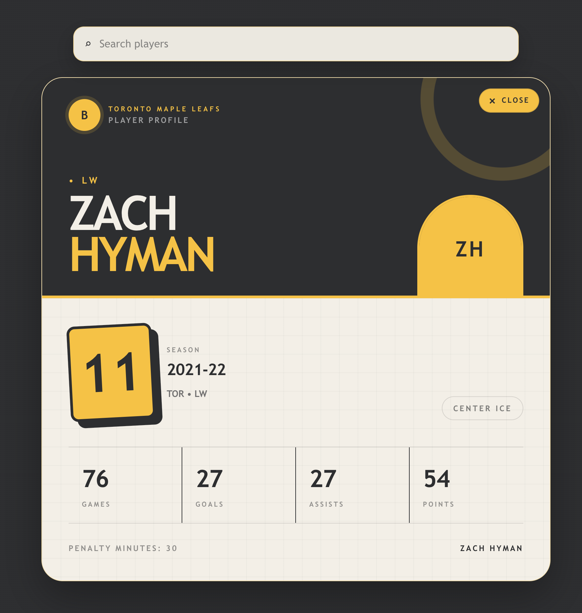

# Hockey Player Card

A small full-stack project I built to refresh my skills with GameSheet's application stack ahead of my technical interview.

React 19 • TypeScript • Vite • Tailwind • Hono • Zod • PostgreSQL



**Live demo:** [hockeyplayercard.vercel.app](https://hockeyplayercard.vercel.app/)

The React frontend provides a searchable directory of player profiles and renders season statistics in a focused card view. Vite handles local development and production builds, while Tailwind is integrated through its Vite plugin. A Hono API exposes the player search endpoint and uses Zod schemas to validate runtime data and infer types. PostgreSQL stores the player and season data, accessed from the API through the `pg` client. The frontend and API are designed to deploy independently to Vercel, with the frontend configured through `VITE_API_URL` in production.

## Local Setup

Prerequisites: Node.js, npm, and a local PostgreSQL server.

1. Create and start the database:

   ```sh
   brew services start postgresql@16
   createdb hockey_card
   ```

2. Configure, install, and seed the API:

   ```sh
   cd api
   printf 'DATABASE_URL=postgresql://localhost:5432/hockey_card\n' > .env
   npm install
   npm run seed
   npm run dev
   ```

3. In a second terminal, install and start the frontend:

   ```sh
   cd web
   npm install
   npm run dev
   ```

Open the local Vite URL shown in the terminal, normally `http://localhost:5173`. The frontend proxies `/api` requests to `http://localhost:3000` during local development.

## Project Structure

- `web/`: React frontend.
- `api/`: Hono API and PostgreSQL seed runner. See [api/README.md](api/README.md) for API and database details.
- `database/`: SQL schema and seed data.